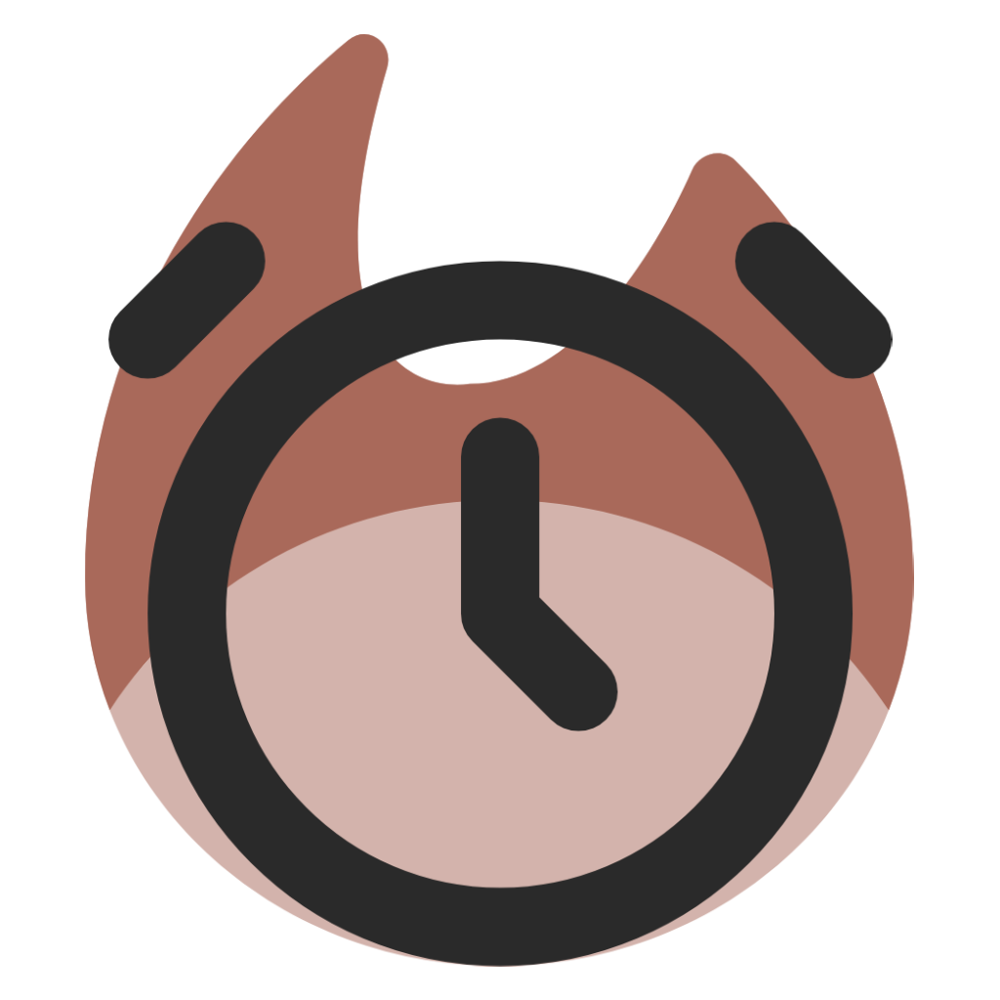

# alarmageddon

an increasingly-annoying alarm clock that only shuts up when you get up

developed in a single day for the february 2025 hackathon at UCL ISD

credits:

- [humza khan](https://github.com/cyb0rg56)
- [christina chung](https://github.com/christina-chung)
- [tom wood](https://github.com/tc-wood)
- [brahim bouharri](https://github.com/bouharri)
- [kadri kurtulus](https://github.com/kadriucl)
